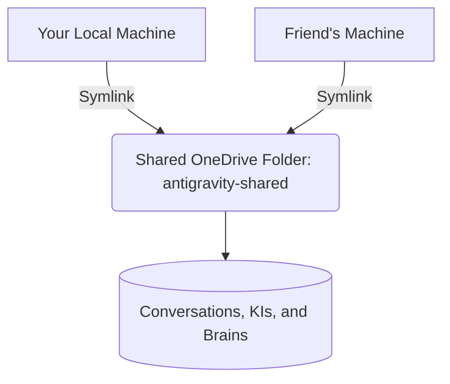

# Guide: Sharing AI Context & Knowledge for Collaborative Development

When you pair program with me (Antigravity/Gemini), you aren't just writing code—you are building a deep repository of project context, architectural decisions, and task checklists. Sharing this "knowledge graph" with a teammate ensures that both of you can work on the project interchangeably without losing progress.

Below is an explanation of how I store context and **three methods** to keep your systems perfectly synchronized.

---

## 1. How Antigravity Stores Your Chat Context

Your local environment stores conversation history and distilled project context in your **App Data Directory** (`~/.gemini/antigravity/`). This directory is broken down into three crucial components:

| Component | Path | Description |
| :--- | :--- | :--- |
| **Conversations** | `~/.gemini/antigravity/conversations/<id>.pb` | Binary Protobuf files storing the exact message history of every chat session. |
| **Brains & Logs** | `~/.gemini/antigravity/brain/<id>/` | Directories containing step-by-step logs (`overview.txt`), scratch scripts, and planning/checklists (`implementation_plan.md`, `task.md`, `walkthrough.md`). |
| **Knowledge Base** | `~/.gemini/antigravity/knowledge/` | Distilled **Knowledge Items (KIs)** summarizing learned patterns, architecture, and bugs. |

---

## Method A: Real-Time Sync via OneDrive Symlink (Recommended)

Since you are already storing your workspace in OneDrive (`/Users/gupvikram/Library/CloudStorage/OneDrive-Personal/`), you can use OneDrive to host a shared `antigravity` application directory. By using a **Symbolic Link (symlink)**, the Gemini App on both machines will read and write to the same shared cloud folder in real-time.



### Step-by-Step Setup

#### **Step 1: Move & Share (Done by You)**
1. Close your code editor and the Gemini Desktop app completely.
2. In your Terminal, move your local application directory to your shared OneDrive directory:
   ```bash
   mv ~/.gemini/antigravity "/Users/gupvikram/Library/CloudStorage/OneDrive-Personal/AI/antigravity-shared"
   ```
3. Create a symbolic link on your machine pointing to the new shared location:
   ```bash
   ln -s "/Users/gupvikram/Library/CloudStorage/OneDrive-Personal/AI/antigravity-shared" ~/.gemini/antigravity
   ```
4. Verify the link was created successfully:
   ```bash
   ls -la ~/.gemini
   # You should see: antigravity -> /Users/gupvikram/Library/CloudStorage/OneDrive-Personal/AI/antigravity-shared
   ```

#### **Step 2: Connect (Done by Your Friend)**
1. Wait for OneDrive to fully synchronize the `antigravity-shared` folder onto your friend's local computer.
2. On their machine, close their code editor and the Gemini app.
3. Back up and delete their existing local folder:
   ```bash
   mv ~/.gemini/antigravity ~/.gemini/antigravity-backup
   ```
4. Create a symlink on their machine pointing to the shared folder in *their* local OneDrive directory:
   ```bash
   # Replace <friend-username> with their macOS user account name
   ln -s "/Users/<friend-username>/Library/CloudStorage/OneDrive-Personal/AI/antigravity-shared" ~/.gemini/antigravity
   ```

> [!IMPORTANT]
> **Best Practice for Symlinks:**
> - **Avoid Concurrent Chats:** To prevent sync conflicts, avoid actively messaging me in the **same conversation** at the exact same moment. If you work on separate conversations or take turns, OneDrive will sync everything cleanly.
> - **Username Paths:** If you have different macOS usernames, the absolute paths inside log files might differ slightly, but I am smart enough to resolve path differences dynamically as long as the relative structures match.

---

## Method B: Git-Based Artifact Tracking (The Cleanest Version-Control Method)

If you prefer to keep your local application directories isolated and separate, you can use Git to track the distilled context. 

When we work on tasks, I naturally create planning artifacts such as:
1. `implementation_plan.md` (The technical roadmap)
2. `task.md` (Active checklist)
3. `walkthrough.md` (Summary of changes & test validations)

### Step-by-Step Setup

1. **Create an AI Docs Folder:**
   In your shared Git repository, create a directory dedicated to tracking context, for example, `docs/ai-context/`.
2. **Instruct the AI:**
   Whenever we start a new feature or task, tell me:
   > *"Write all planning, tasks, and walkthrough artifacts into the `./docs/ai-context/` directory of the project."*
3. **Commit the Artifacts:**
   Before pushed changes are handed off to your friend, ensure you commit the generated `.md` files in `docs/ai-context/`.
4. **Resuming Context:**
   When your friend pulls your branch, they can simply tell me:
   > *"Read the latest files in `./docs/ai-context/`. Summarize where we left off and continue with the next items on the checklist."*

> [!TIP]
> **Why this works beautifully:**
> Git maintains a strict history of what was built, why, and what was verified. This mirrors professional software development workflows and avoids any potential cloud storage sync conflicts.

---

## Method C: Manual Context Transfer (The Low-Friction Method)

If you just want to pass the torch occasionally without setting up symlinks or tracking extra files in Git:

1. **Generate a Session Summary:**
   At the end of your session, ask me:
   > *"Give me a concise handoff summary of what we accomplished, what code was modified, and what the immediate next steps are."*
2. **Share the Summary:**
   Copy-paste that handoff summary into your team's communication channel (Slack, WhatsApp, Discord, or an email).
3. **Friend's Input:**
   Your friend can paste that summary directly into their fresh chat prompt:
   > *"Here is the context of what my partner completed in their last session. Let's pick up from here: [Pasted Summary]"*

---

## Comparison Table

| Metric | Method A (OneDrive Symlink) | Method B (Git Artifacts) | Method C (Manual Summary) |
| :--- | :--- | :--- | :--- |
| **Setup Effort** | Medium (one-time terminal command) | Low (just a folder in Git) | None |
| **Context Richness** | **Excellent** (Complete chat history, previous chats, full logs, and KIs) | **Great** (Distilled plans, checklists, and outcomes) | **Good** (High-level goals and next steps) |
| **Friction** | **Zero** (completely automatic background sync) | **Low** (automatic git commit along with code) | **Medium** (requires manually copying/pasting) |
| **Risk of Conflict** | Low-Medium (if both chatting concurrently) | None (standard Git merge resolution) | None |

### Recommendation
* **If you want complete history and chat restoration:** Use **Method A (OneDrive Symlink)**. It makes both your systems act as a single unified portal.
* **If you want clean, structured documentation:** Use **Method B (Git Artifacts)**. This creates a permanent, version-controlled audit trail of how the application was built.
* **Best of Both Worlds:** Use **Method A** for seamless local workflows, and instruct the AI to write `walkthrough.md` files in a `docs/` folder in Git for documentation!
